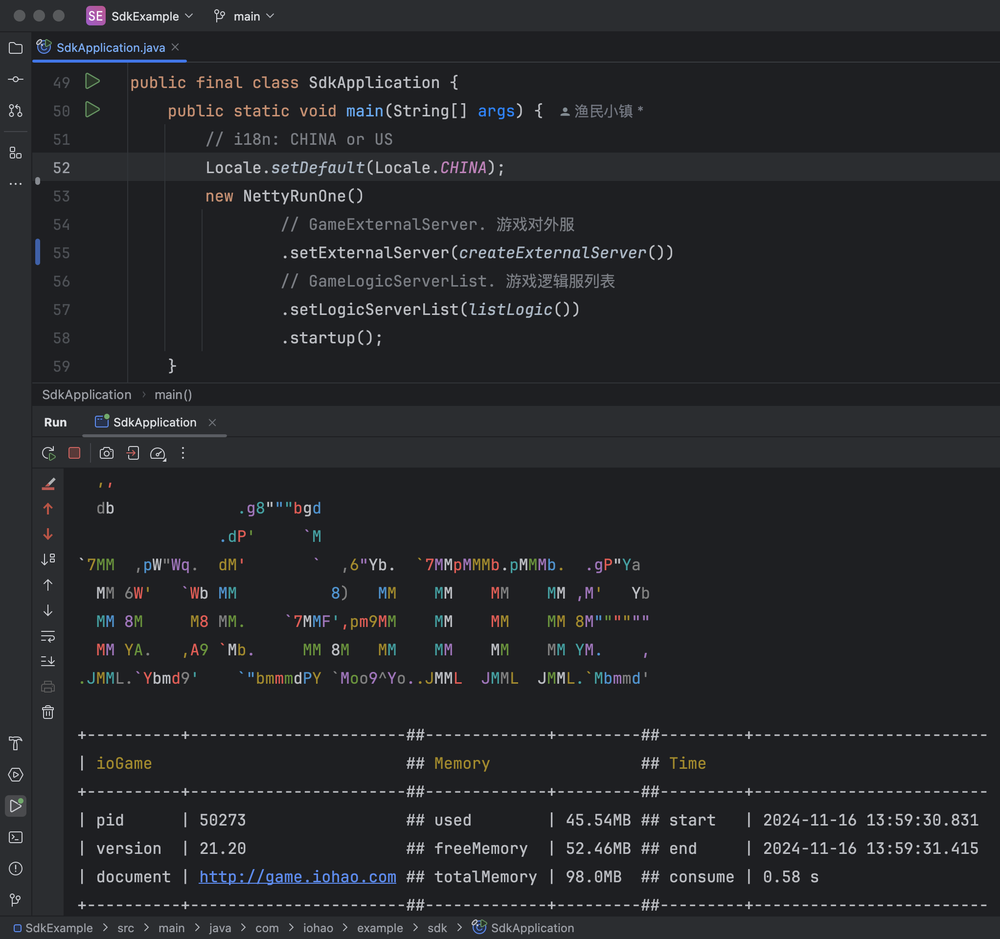
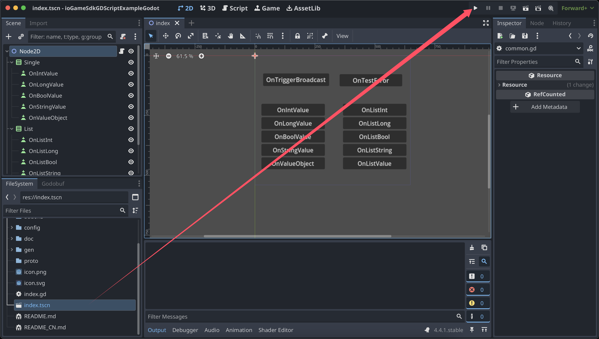
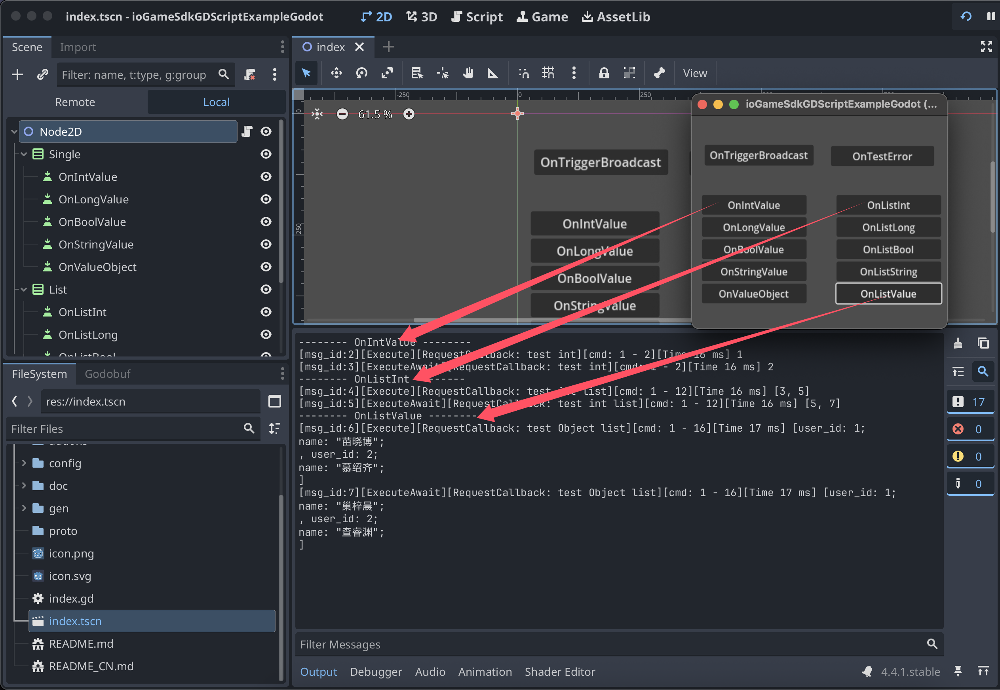
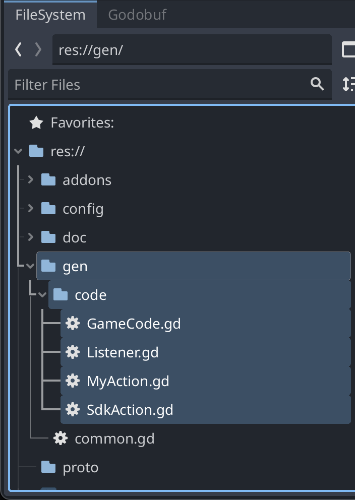
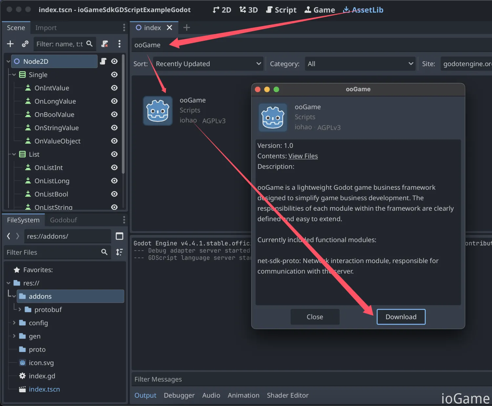
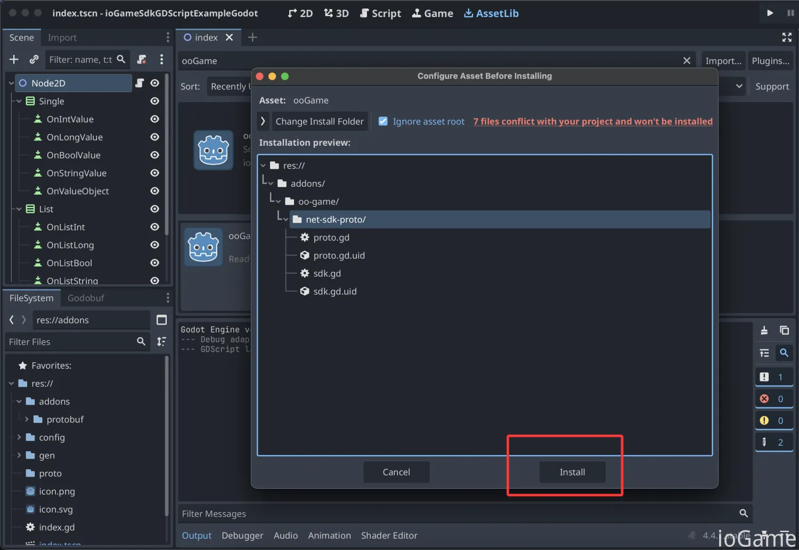
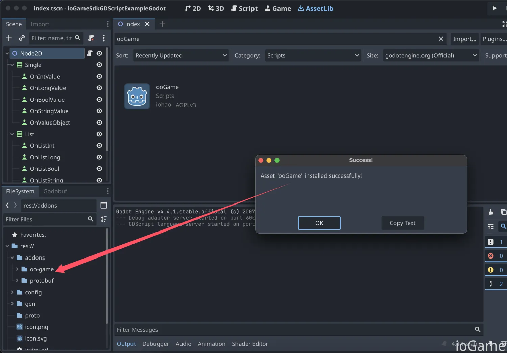
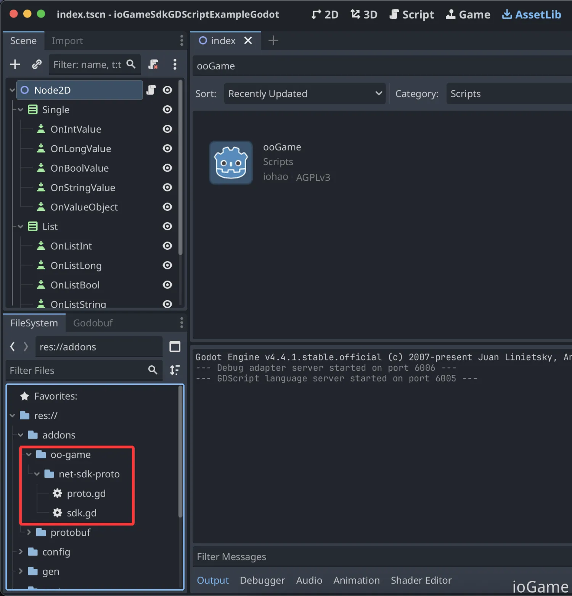

## ioGameSdkGDScriptExampleGodot

[Sdk、Godot 示例](https://www.yuque.com/iohao/game/gte3mvo5qdpq56k0)文档


[ioGame GDScript SDK](https://github.com/iohao/ioGame/issues/444) 提供了 Netty、WebScoket、Protobuf、GDScript、[ioGame](https://github.com/iohao/ioGame/) 游戏服务器交互的简单封装。


`./gen/code` 目录中的 `action、广播、错误码` ...等交互接口文件由  [ioGame 生成](https://www.yuque.com/iohao/game/irth38)。代码生成可为客户端开发者减少巨大的工作量，并可为客户端开发者屏蔽路由等概念。


**SDK 代码生成的几个优势**

1. 帮助客户端开发者减少巨大的工作量，**不需要编写大量的模板代码**。
2. **语义明确，清晰**。生成的交互代码即能明确所需要的参数类型，又能明确服务器是否会有返回值。这些会在生成接口时就提前明确好。
3. 由于我们可以做到明确交互接口，进而可以明确参数类型。这使得**接口方法参数类型安全、明确**，从而有效避免安全隐患，从而**减少联调时的低级错误**。
4. 减少服务器与客户端双方对接时的沟通成本，代码即文档。生成的联调代码中有文档与使用示例，方法上的示例会教你如何使用，即使是新手也能做到**零学习成本**。
5. 帮助客户端开发者屏蔽与服务器交互部分，**将更多的精力放在真正的业务上**。
6. 为双方联调减少心智负担。联调代码使用简单，**与本地方法调用一般丝滑**。
7. 抛弃传统面向协议对接的方式，转而使用**面向接口方法的对接方式**。
8. 当我们的 java 代码编写完成后，我们的文档及交互接口可做到同步更新，不需要额外花时间去维护对接文档及其内容。


## 快速开始

### 启动游戏服务器

服务器源码 [ioGameServer](https://github.com/iohao/ioGameExamples/tree/main/SdkExample)

> 运行 SdkApplication.java 启动游戏服务器




### 启动 Godot

> Godot Version: 4.4.1
>

启动客户端后，点击按钮就能与 ioGame 进行通信了。相关的交互的 action 由服务器生成，无需开发者编写。

​	


### 启动页

点击按钮会向服务器发送请求，并接收服务器的响应数据。




### SDK 设置说明

my_net_config.gd 文件，该配置文件做了以下事情

1. 错误码及广播监听相关的加载。
2. IoGameSetting.listen_message_callback：自定义消息监听。
3. socket_init()：网络实现的配置、登录。
4. IoGameSetting.start_net： 启动 ioGame Sdk。

```csharp
class_name MyNetConfig
extends RefCounted

static var _socket: MyNetChannel = MyNetChannel.new()
static var current_time_millis: int = 0

static func start_net():
	# biz code init
	GameCode.init()
	Listener.listener_ioGame()
	
	# --------- IoGameSetting ---------
	var setting := IoGame.IoGameSetting
	setting.enable_dev_mode = true
	setting.set_language(IoGame.IoGameLanguage.Us)
	# message callback. cn: 回调监听
	setting.listen_message_callback = MyListenMessageCallback.new()
	# set socket. cn: 设置网络连接
	setting.net_channel = _socket
	
	socket_init()
	setting.start_net()


static func poll():
	_socket.poll()

const Common = preload("res://gen/common.gd")

static func socket_init():
	_socket.on_open = func():
		var verify_message := Common.LoginVerifyMessage.new()
		verify_message.set_jwt("1")
		
		SdkAction.of_login_verify(verify_message, func(result: IoGame.ResponseResult):
				var value := result.get_value(Common.UserMessage) as Common.UserMessage
				print("user: ", value)
		)


static var _heartbeat_message_bytes := IoGame.Proto.ExternalMessage.new().to_bytes()
static var _heartbeat_counter: int = 1

static func send_idle() -> void:
	_heartbeat_counter += 1
	#print("-------- ..HeartbeatMessage {%s}" % [_heartbeat_counter])
	IoGame.IoGameSetting.net_channel.write_and_flush_byte(_heartbeat_message_bytes)


class MyListenMessageCallback extends IoGame.ListenMessageCallback:
	func on_idle_callback(message: Proto.ExternalMessage):
		var data_bytes := message.get_data()
		var long_value := IoGame.Proto.LongValue.new()
		long_value.from_bytes(data_bytes)
		# Synchronize the time of each heartbeat with that of the server.
		# cn: 每次心跳与服务器的时间同步
		MyNetConfig.current_time_millis = long_value.get_value()


class MyNetChannel extends IoGame.SimpleNetChannel:
	var _last_state: WebSocketPeer.State = WebSocketPeer.State.STATE_CLOSED
	var _socket: WebSocketPeer = WebSocketPeer.new()
	var _url: String = "ws://127.0.0.1:10100/websocket"

	var on_open: Callable = func():
		print("on_open")
	
	var on_connecting: Callable = func():
		print("on_connecting")

	var on_connect_error: Callable = func(error: int):
		print("on_connect_error:", error)

	var on_closing: Callable = func():
		print("on_closing")

	var on_closed: Callable = func():
		print("on_closed")

	func prepare() -> void:
		if _url == null or _url.is_empty():
			_url = IoGame.IoGameSetting.url

		var error: int = _socket.connect_to_url(_url)

		if error != 0:
			on_connect_error.call(error)
			return
		
		_last_state = _socket.get_ready_state()


	func write_and_flush_byte(bytes: PackedByteArray) -> void:
		_socket.send(bytes)


	func poll() -> void:
		if _socket.get_ready_state() != WebSocketPeer.State.STATE_CLOSED:
			_socket.poll()
		
		while _socket.get_available_packet_count() > 0:
			var packet := _socket.get_packet()
			var message := IoGame.Proto.ExternalMessage.new()
			message.from_bytes(packet)
			self.accept_message(message)
		
		var state: WebSocketPeer.State = _socket.get_ready_state()
		if _last_state == state:
			return
		
		_last_state = state

		match state:
			WebSocketPeer.State.STATE_OPEN:
				on_open.call()
			WebSocketPeer.State.STATE_CONNECTING:
				on_connecting.call()
			WebSocketPeer.State.STATE_CLOSING:
				on_closing.call()
			WebSocketPeer.State.STATE_CLOSED:
				on_closed.call()
			_:
				printerr("Socket Unknown Status.")

```


## 接口源码目录

`./gen/code` 目录中的 `action、广播、错误码` ...等交互接口文件由  [ioGame 生成](https://www.yuque.com/iohao/game/irth38)。代码生成可为客户端开发者减少巨大的工作量，代码使用简单，与本地方法调用一般丝滑。




## 如何根据 .proto 生成相关 pb

> see https://github.com/oniksan/godobuf
>
> or [SDK GDScript proto](https://www.yuque.com/iohao/game/cznbp9z3ncncb5p9#PdrnX)


## 最后

记住，你不需要编写任何交互文件（`action、广播、错误码`），这些是由 ioGame 服务器生成的，你只需要关注真正的业务逻辑。


## 新项目如何安装 ioGame GDScript SDK

当前 demo 已经安装了 ioGame GDScript SDK，下面介绍如何在新项目中安装 SDK。

通过 AssetLib 搜索 ooGame 并下载



点击 Install 按钮，将 sdk 安装到 addons 插件目录中。



安装后 addons 目录会多出 sdk 相关文件






